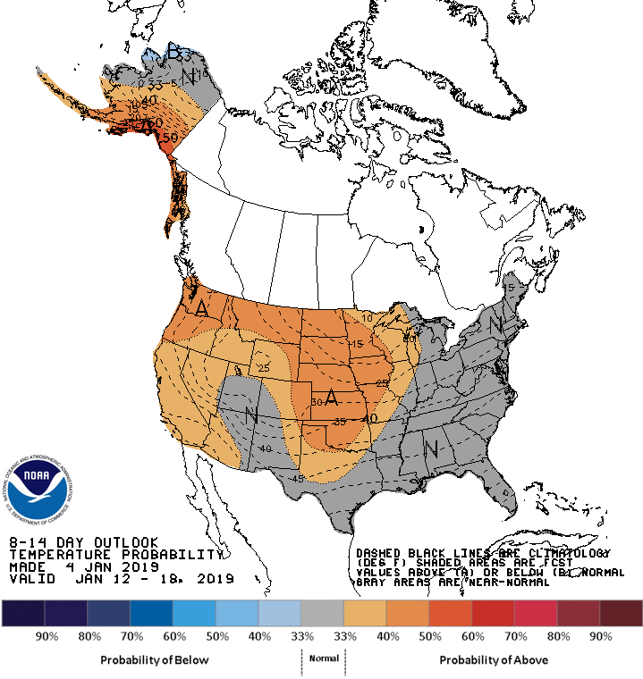

<!--
Welcome to the Hay Report for the week ending January 5, 2019. Hay dot Report analyzes the hay and forage market across the plains states of Montana, Wyoming, South Dakota, Colorado, Nebraska, Kansas, Oklahoma, and Texas.
-->

## This Week

- No report this week from Corsica, SD, Colorado, or Kansas
- Mild weather in Northern Plains reducing usage and increasing exports
- Could a jump in costs be coming in the Central and Southern Plains?
- +33% for cornstalks in Panhandle-High Plains of Texas
- +21% for dehydrated alfalfa pellets in Eastern and Central Nebraska

<!--
There was no report this week from the Corsica hay auction, Colorado, or Kansas.
In this episode, weather is leading to opportunities for producers in the Northern Plains, but could a jump in prices be coming for the Central and Southern Plains? As of now, prices inreases are limited to several regions and commodities.
-->

```{r setup, include=FALSE}
knitr::opts_chunk$set(echo = FALSE, warning = FALSE, message = FALSE)

library(dplyr)
library(tidyr)
library(ggplot2)

load('../data/report_data.rds')

CURRENT_DATE <- as.Date('2019-01-05')
CURRENT_WEEK <- lubridate::week(CURRENT_DATE)

state_lookup <- data.frame(state.name, state.abb)

region_lookup <- read.csv('~/hay.report/data/region_lookup.csv',
                          stringsAsFactors = FALSE)

report_data %>% 
  inner_join(state_lookup,
             by = c('state' = 'state.name')) %>% 
  left_join(region_lookup,
            by = c('state' = 'state',
                   'region' = 'region')) %>%
  filter(between(report_date, CURRENT_DATE - 31, CURRENT_DATE)) %>% 
  replace_na(list(size = '', shape = '', quality = '')) ->
  video_data

## Functions

week_ending <- function(DATE) {
  DATE + 7 - lubridate::wday(DATE)
}

graph_benchmark <- function(input_data, input_forage, 
                            input_shape, input_size, input_quality) {
  
  input_data %>%
  filter(forage == input_forage,
         shape == input_shape,
         size == input_size,
         quality == input_quality,
         !is.na(price_low)) %>%
  rowwise() %>% 
  mutate(price_max = max(c(price_low, price_high), na.rm = TRUE),
         report_week_ending = week_ending(report_date)) %>% 
  ungroup() %>% 
  ggplot(aes(x = report_week_ending, y = price_avg, 
             label = paste(region.abb, round(price_avg)),
            ymin = price_low, ymax = price_max
            )
         ) +
  geom_pointrange() +
  ggrepel::geom_text_repel(nudge_x = 1) +
  theme_bw() +
  labs(title = paste(input_forage, input_quality, input_size, input_shape),
       x = 'Week Ending',
        y = 'Price') 
}

benchmark_table <- . %>% 
    filter(!is.na(benchmark)) %>% 
  select(benchmark, report_year, report_week, price_low, price_high) %>% 
  gather(key = price_type, value = price, contains('price')) %>% 
  group_by(benchmark, report_year, report_week) %>% 
  summarize(benchmark_value = median(price, na.rm = TRUE)) %>% 
  group_by(benchmark) %>% 
  arrange(benchmark, report_year, report_week) %>% 
  summarize(current_value = last(benchmark_value) %>% 
              round(),
            one_week_change = ((last(benchmark_value) - first(benchmark_value))/first(benchmark_value)) %>% 
              magrittr::multiply_by(100) %>% 
              round() %>% 
              paste0('%')) %>% 
  knitr::kable(col.names = c('Commodity', 'Benchmark Price', '2 Wk Change'),
               align = 'lrr')
```

## Thank You

- Jack Carson, Oklahoma Dept of AG-USDA Market News, Oklahoma City, OK
- Heath Dewey, USDA-CO Dept of Ag Market News Service, Greeley, CO
- Lana Hutto, USDA Market News Service, Amarillo, TX
- John Kimbrell, USDA Market News Service, Billings, MT
- Ross Kotewa, USDA-SD Dept of Ag Market News Service, Sioux Falls, SD
- Kim Nettleton, Kansas Department of Agriculture, Manhattan, KS
- Thomas Walthers, USDA NE and USDA WY

<!--
Hay dot Report relies on the data and commentary of the USDA Agriculture Marketing Service. We thank them for their work serving farmers and ranchers across the country.
-->

## Benchmarks

- Key hay and forage types
- Multi-state & single state

<!--
Hay dot Report tracks several hay types to provide a broad view of the market. First is a look at alfalfa followed by grass hay. 
-->

## 

```{r alfalfa_benchmarks, eval = FALSE}
video_data %>% 
  filter(forage %in% c('Alfalfa', 'Dehydrated Alfalfa'),
         !is.na(price_low),
         between(report_date, CURRENT_DATE - 14, CURRENT_DATE)) %>% 
  mutate(benchmark = case_when(
    state == 'Kansas' & quality == 'Supreme' & shape == '' ~ 'Kansas Supreme Dairy',
    state == 'Texas' & quality == 'Premium/Supreme' & size == 'Large' & shape == 'Squares' ~ 'Texas Premium/Supreme',
    quality == 'Premium' & size == 'Large' & shape == 'Squares' ~ 'Multi-State Premium Large Squares',
    quality == 'Premium' & size == 'Small' & shape == 'Squares' ~ 'Multi-State Premium Small Squares',
    forage == 'Dehydrated Alfalfa' & quality == '17%' ~ 'Multi-State Dehydrated Pellets 17%',
    TRUE ~ NA_character_
  )) %>% 
  filter(!is.na(benchmark)) %>% 
  benchmark_table() ->
  alfalfa_table

save(alfalfa_table, file = paste0('../shared-data-products/alfalfa-table-', CURRENT_DATE, '.rda'))

alfalfa_table
```

```{r apls, fig.height=4.5}
video_data %>%
  graph_benchmark(input_forage = 'Alfalfa',
                  input_quality = 'Premium',
                  input_size = 'Large',
                  input_shape = 'Squares'
                  )

```

<!--
After the holidays, benchmark alfalfa commodities are steady. Premium Large Square median prices and ranges were unchanged from previous reports.
-->

##

```{r tapsls, fig.height=4.5}
video_data %>%
  #filter(state == 'Texas') %>% 
  graph_benchmark(input_forage = 'Alfalfa',
                  input_quality = 'Premium/Supreme',
                  input_size = 'Large',
                  input_shape = 'Squares'
                  )

```

<!--
Texas Premium Supreme Large Squares were also unchanged. 
-->

##

```{r apss, fig.height=4.5}
video_data %>%
  graph_benchmark(input_forage = 'Alfalfa',
                  input_quality = 'Premium',
                  input_size = 'Small',
                  input_shape = 'Squares'
                  )

```

<!--
After ticking up for a week, median prices for Premium Small Squares ticked back down. The price spread between the Northern Plains and the High Plains of Texas is as large as the distance between the two regions. Even with the hundred dollar difference and declining fuel prices, the eight hundred plus mile shipping cost may be too great for this commodity.
-->

##

```{r grass_benchmarks, eval = FALSE}
report_data %>% 
  filter(forage %in% c('Grass', 'Coastal Bermuda', 'Bluestem'),
         !is.na(price_low),
         between(report_date, CURRENT_DATE - 14, CURRENT_DATE)) %>% 
  mutate(benchmark = case_when(
    quality == 'Premium' & size == 'Small' & shape == 'Squares' ~ 'Multi-State Premium Small Squares',
    quality == 'Good' & size == 'Large' & shape == 'Rounds' ~ 'Multi-State Good Large Rounds',
    state == 'Texas' & forage == 'Coastal Bermuda' & size == 'Large' & shape == 'Rounds' & quality == 'Good/Premium' ~ 'Texas G/P Coastal Bermuda Large Rounds',
    forage == 'Bluestem' & size == 'Large' & shape == 'Squares' ~ 'Kansas Bluestem Large Squares',
    TRUE ~ NA_character_
  )) %>% 
  filter(!is.na(benchmark)) %>% 
  benchmark_table() ->
  grass_table

save(grass_table, file = paste0('../data-products/grass-table-', CURRENT_DATE, '.rda'))

grass_table
```

```{r cbplr, fig.height=4.5}
video_data %>%
  filter(state == 'Texas') %>% 
  graph_benchmark(input_forage = 'Coastal Bermuda',
                  input_quality = 'Good/Premium',
                  input_size = 'Large',
                  input_shape = 'Rounds'
                  )

```

<!--
Turning to grass, on December 14, Lana Hutto reported that: "Coastal Bermuda producers in East, North and South Texas have battled army worms, early frosts and rain in getting their 4th cutting therefore reports of short supply with many producers already sold out." As of now, prices are steady across the two regions.
-->

##

```{r cbpss, fig.height=4.5}
video_data %>%
  graph_benchmark(input_forage = 'Grass',
                  input_quality = 'Good',
                  input_size = 'Large',
                  input_shape = 'Rounds'
                  )

```

<!--
The price for Good Large Grass Rounds is largely steady, but prices at Corsica and in Eastern and Central Nebraska suggest a slight downward trend. Interestingly, Good Large Rounds in Montana are relatively high compared to other regions.
-->

## Higher Prices on the Horizon?

- AMS commentary suggests winter weather may lead to higher prices in the Central and Southern Plains
- Mild weather in Northern Plains leading to lower local demand and prices

<!--
Despite hay prices being steady to a slight downward trend, there are concerns that prices may be on the rise for cornstalks and other lower-quality commodities, which, in turn, could result in higher prices for high-quality forages. This contrasts with the Northern Plains, where a mild winter has led to an excess supply of hay.
-->

## Concerns from South Dakota and Nebraska

Thomas Walthers, reporting on Nebraska

- Halted cornstalk production 
- Only increase was +$20 for dehydrated alfalfa pellets in eastern NE
- Milo and corn still being harvested in western NE

Ross Kotewa, Sioux Falls, SD

- Warm weather leading to declining feed yard conditions
- Increase need for straw bedding

<!--
Thomas Walthers, who covers Wyoming and Nebraska, reported on the cornstalk shortage in Nebraska. Rain and snow over the holidays brought cornstalk production to a halt, while producers in western Nebraska are battling a wet Fall and Winter, with milo and corn still being harvested. Prices are steady for cornstalks, but there has been a sharp increase in dehydrated alfalfa pellets. 
In South Dakota, Ross Kotewa is reporting that recent mild weather is leading to declining feedlot conditions and an inreased demand for straw bedding.
-->

##

```{r cornstalks, fig.height=4.5}
video_data %>%
  filter(forage == 'Cornstalks') %>% 
  rowwise() %>% 
  mutate(price_max = max(c(price_low, price_high), na.rm = TRUE),
         report_week_ending = week_ending(report_date),
         Ground = ifelse(shape == 'Ground', 'Ground', 'Baled')) %>% 
  ungroup() %>% 
  ggplot(aes(x = report_week_ending, y = price_avg, 
             label = paste(region.abb, round(price_avg)),
            ymin = price_low, ymax = price_max
            )
         ) +
  geom_pointrange() +
  ggrepel::geom_text_repel(nudge_x = 1, aes(color = Ground)) +
  scale_color_manual(values = c('black', 'red')) +
  theme_bw() +
  labs(title = 'Multi-State Cornstalk',
       x = 'Week Ending',
      y = 'Price') 

```

<!--
What may be in store for Nebraska is a thirty-three percent increase like the one saw in the Panhandle and High Plains region of Texas. Two weeks ago, delivered cornstalk bales were 75 dollars but are now selling at 100 dollars. Producers who can grind and ship cornstalks may be in a good position to meet this increased demand.
-->

##

```{r ap17, fig.height=4.5}
video_data %>%
  graph_benchmark(input_forage = 'Dehydrated Alfalfa',
                  input_quality = '17%',
                  input_size = '',
                  input_shape = 'Pellets'
                  )

```

<!--
The two week twenty dollar increase in Eastern and Central Nebraska underplays the fifty dollar increase -- over twenty percent -- from three weeks ago. Prices in the Platte Valley have only ticked up. We will see if this remains true or if prices see a similar increase in this region as well as South Central Kansas.
-->

## Montana and Central/Western Wyoming in Good Position

John Kimbrell reports that in Montana:

- Mild weather 
- Under-utilization of baled hay 
- Out-of-state demand for large squares

Thomas Walthers, reporting on Wyoming

- Large squares for dairies
- Small squares for horse owners

<!--
In contrast to Nebraska and the High Plains of Texas, prices and demand in Montana and Wyoming remain low. Current sales are being driven by out-of-state buyers. Large alfalfa squares are being bought by dairies, while horse-owners are purchasing small squares.
-->

## 8 to 14 Day Temperature

```{r, out.height="500px"}

```


<!--
The Climate Prediction Center released their eight to fourteen day forecasts on Friday, January 4. Temperatures across the Plains are expected to be above-average.
-->

## 8 to 14 Day Precipitation

```{r, out.height="500px"}

```


<!--
The higher temperatures may led to conditions drying out in the Central Plains, but there's an increased probability of precipitation for much of the Central and Southern Plains.
-->

## Until Next Week

Visit www.hay.report for archives and resources.

<!--
Thank you for watching. Join Hay dot Report every Saturday for an update on the Plains hay and forage market. In the meantime, visit www.hay.report for archives. We love feedback. Please leave a comment with how Hay dot Report can continue to improve and serve you better.  
-->

##
